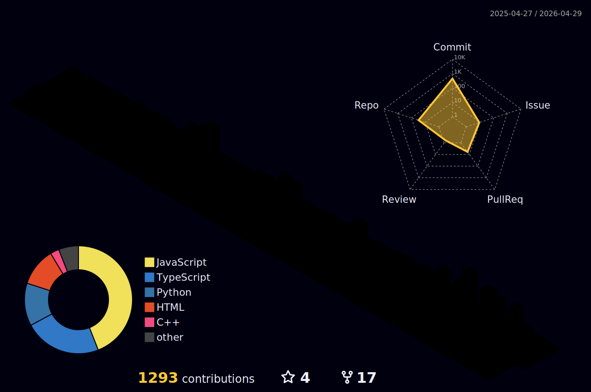

<div align="center">

<!-- ANIMATED HEADER -->


<!-- TYPING SVG -->
<a href="https://git.io/typing-svg"></a>

<br/>

<!-- SOCIAL BADGES -->
[](https://github.com/AryanSaxenaa)
[](mailto:aryansaxenaalig@gmail.com)
[](https://www.npmjs.com/package/vibedit)

</div>

<!-- ABOUT ME -->
##  About Me

```yaml
name: Aryan Saxena
location: India
current_focus: Full Stack Development | Blockchain | AI Tools
education: Engineering Student
open_to: Collaborations, Open Source, Freelance

interests:
  - Building AI-powered developer tools
  - Decentralized applications & Web3
  - Cybersecurity & QR phishing prevention
  - Game development & creative coding
  - Publishing NPM packages

fun_fact: "I built a text-based sci-fi strategy game with zero dependencies — pure vanilla JS"
```

---

<!-- FEATURED PROJECTS -->
## 🏗️ Featured Projects

<div align="center">
<table>
<tr>
<td width="50%" valign="top">

###  Vibedit — AI Video Editor
**Conversational AI-powered video editing via CLI**
- Natural language → FFmpeg commands
- Published on NPM as `vibedit`
- Groq AI + FFmpeg backend
- Smart context detection & error recovery

[](https://github.com/AryanSaxenaa/Vibe-Editor)
[](https://www.npmjs.com/package/vibedit)

</td>
<td width="50%" valign="top">

###  Veritas — Carbon Credit Marketplace
**Blockchain-first decentralized carbon trading**
- Ethereum smart contracts (ERC-1155)
- Trustless verification & atomic swaps
- On-chain audit trail for every credit
- OpenZeppelin AccessControl

[](https://github.com/AryanSaxenaa/veritas)

</td>
</tr>
<tr>
<td width="50%" valign="top">

###  QR-Guard — QR Security Interceptor
**Zero-trust QR code scanner for mobile**
- X-Ray URL expansion (follows redirects safely)
- Homograph attack & spoofing detection
- Multi-factor risk scoring engine
- React Native + Expo

[](https://github.com/AryanSaxenaa/qr-guard)

</td>
<td width="50%" valign="top">

###  The Terminus Project
**Text-based sci-fi strategy game**
- ASCII art visuals + dynamic audio
- Resource management & tech trees
- Multiple endings: Renewal, Transcendence, Control
- Zero dependencies — pure vanilla JS

[](https://github.com/AryanSaxenaa/TheTerminusProject)

</td>
</tr>
</table>
</div>

---

<!-- TECH STACK -->
## 🛠️ Tech Stack

<div align="center">

### Languages


### Frameworks & Libraries


### Blockchain & Web3


### Databases & Tools


</div>

---

<!-- 3D CONTRIBUTION GRAPH -->
## 🧊 3D Contribution Map

<div align="center">

</div>

> *Powered by [github-profile-3d-contrib](https://github.com/yoshi389111/github-profile-3d-contrib) — auto-generated daily via GitHub Actions*

---

<!-- GITHUB STATS -->
## 📊 GitHub Analytics

<div align="center">


</div>

<div align="center">

</div>

<!-- ACTIVITY GRAPH -->
<div align="center">

</div>

---

<!-- PROFILE VIEWS & FOOTER -->
<div align="center">


<br/><br/>


</div>
